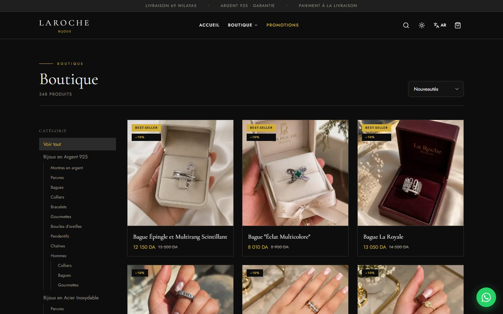
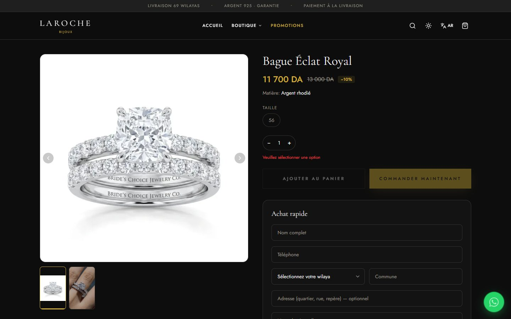
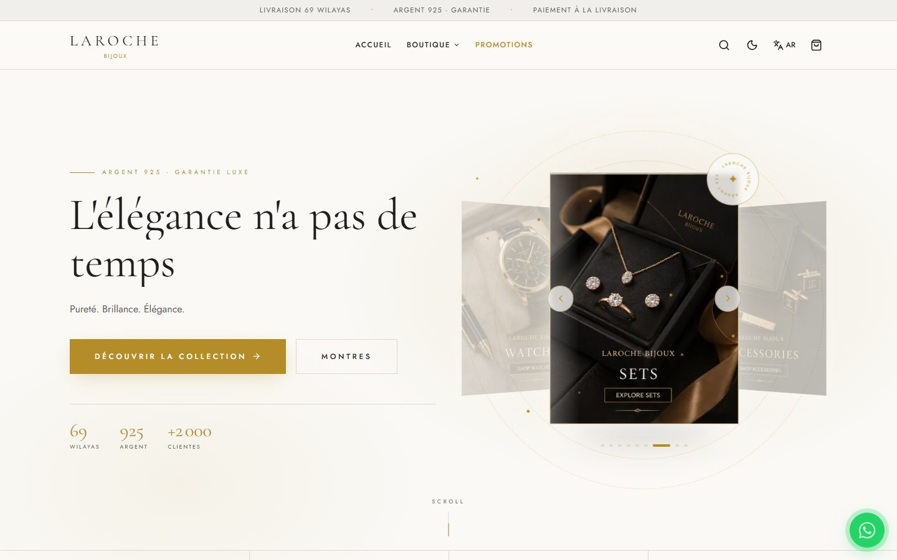
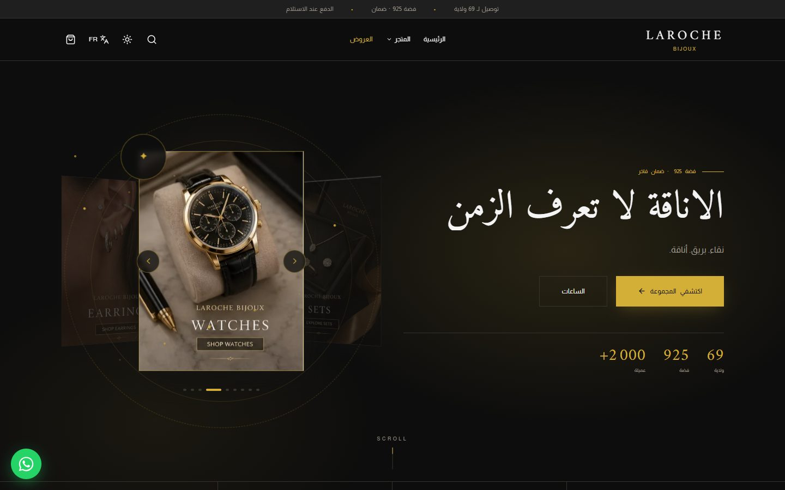
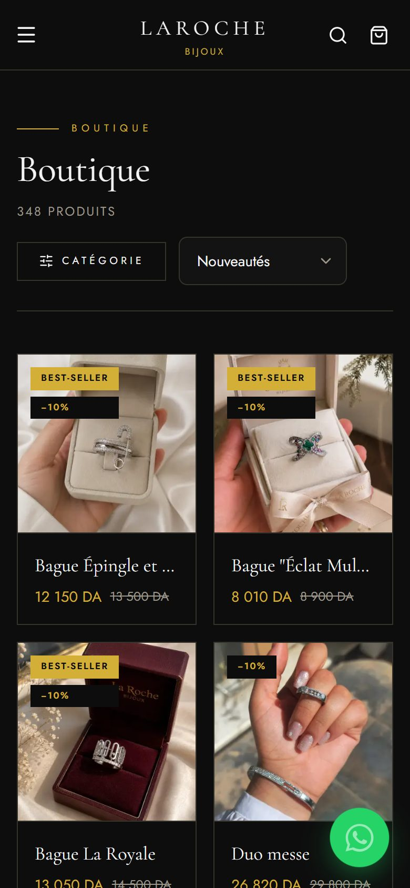
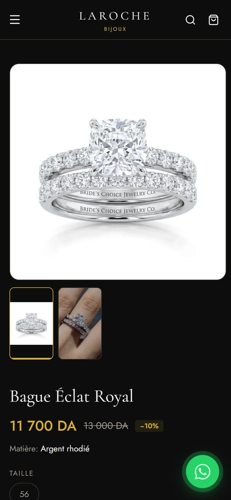

<div align="center">

# Laroche Bijoux

**A bilingual luxury jewelry storefront, admin suite and in-store point of sale for an Algerian jeweler.**

[larochebijoux.com](https://www.larochebijoux.com) · Designed and built by [Alaa Younsi](https://alaayounsi.vercel.app/)


</div>

---

## Overview

Laroche Bijoux sells 925 silver, stainless-steel jewelry and watches across all 69 wilayas of
Algeria. This project is the whole business in one codebase:

- **Storefront.** A French / Arabic (full RTL) shop with dark and light themes, cash-on-delivery
  and online card checkout, and live delivery pricing per wilaya.
- **Admin dashboard.** Orders, catalogue, promotions, shipping, staff accounts, marketing pixels
  and financial reporting.
- **Magasin (POS).** A multi-shop till for the physical boutiques, with barcode scanning, thermal
  receipts, invoices and silver sold by weight.

## Screenshots

### Desktop

| Shop | Product |
| :---: | :---: |
|  |  |
| **Light theme** | **Arabic (RTL)** |
|  |  |

### Mobile

| Home | Shop | Product | Light theme |
| :---: | :---: | :---: | :---: |
|  |  |  |  |

## Design

The site should feel like a luxury jewelry house, not a generic online store. The product
photography does most of the work, and the layout stays out of its way.

- **Editorial minimalism.** Sharp corners, hairline borders, wide-tracked uppercase eyebrows and
  plenty of negative space.
- **Palette.** Deep black `#0D0D0D` with royal gold `#D4AF37`, plus an ivory light theme. The
  visitor's theme and language are applied before React mounts, so there is no flash on load.
- **Typography.** Cormorant Garamond for display, Jost for text, and Amiri / Almarai for Arabic.
  All fonts are self-hosted.
- **Motion.** A 3D card carousel in the hero, curtain reveals, mouse parallax, count-ups and tilt
  cards. Every animation respects `prefers-reduced-motion`.
- **Bilingual.** Each layout mirrors fully in Arabic; RTL is not just flipped text alignment.

## Features

**Storefront**
- Nested category tree, search, sorting and infinite scroll
- Product variants (size, color) with their own price and stock, product videos and a photo gallery
- Cart, one-page COD checkout and a "quick buy" form on each product page
- Home or pickup-point (Point Relais) delivery with per-wilaya pricing
- Online payment through Chargily Pay (EDAHABIA / CIB), with cash on delivery alongside
- Newsletter, store locator and WhatsApp contact

**Admin dashboard**
- Order board by status, order details and manual order entry
- Product editor with image ordering, color swatches, variants and in-browser video compression
- Promotions engine: timed discounts on a whole category subtree, applied server-side
- Silver priced per gram, set per silver type
- NOEST Express integration to create parcels and track them
- Staff accounts with per-section permissions, enforced in the database
- GA4 and multiple Meta pixels, all managed from the dashboard
- Email notifications for new orders
- Revenue, cost and margin reporting, aggregated in SQL

**Magasin (point of sale)**
- Multiple shops, each with its own stock and till
- EAN-13 barcode generation and scanning, 58 mm thermal receipts
- Invoices, pro-forma quotes, deposits and customer debts
- A bulk-silver gram pool with weighted-average costing

## Tech stack

| Layer | Technology |
| --- | --- |
| Frontend | React 19, TypeScript (strict), Vite, Tailwind CSS, Framer Motion |
| State & data | TanStack Query, Zustand |
| Forms & validation | react-hook-form, Zod |
| Backend | Supabase: PostgreSQL, Auth, Storage, Row-Level Security, PL/pgSQL RPCs |
| Serverless | Vercel Edge Functions (payments, shipping, staff management), Supabase Edge Functions (email) |
| Integrations | Chargily Pay v2, NOEST Express, Resend, Google Analytics 4, Meta Pixel |
| Media | ffmpeg.wasm (client-side video compression), Supabase image transformations |
| Hosting & tooling | Vercel, Bun, ESLint |

## Security

- **Prices are never trusted from the client.** Every order goes through a server-side Postgres
  function that recomputes item prices, variants, promotions and delivery fees from the database.
- **Row-Level Security on every table.** Staff permissions are checked in RLS policies and RPCs,
  not only in the UI. The permission checks fail closed.
- **Secrets stay on the server.** Payment, shipping and service-role keys live only in serverless
  functions. The browser only ever gets the public anon key.
- **Verified payments.** Chargily webhooks are checked with HMAC-SHA256 over the raw request body,
  using a constant-time comparison. Only the service role can mark an order as paid.
- **Authenticated server endpoints.** Admin and shipping endpoints verify the caller's Supabase
  session and role before they act.
- **Hardened database functions.** `SECURITY DEFINER` functions pin their `search_path`, and
  execute rights are revoked from `PUBLIC` and granted explicitly.
- **Strict HTTP headers.** Content-Security-Policy, HSTS (preload), `X-Frame-Options`,
  `X-Content-Type-Options`, `Referrer-Policy` and `Permissions-Policy`.
- **Validated input.** Zod schemas on every form. Edge middleware escapes all dynamic HTML.

## Performance

- **Code splitting.** Every route is lazy-loaded, so the admin and POS never ship to shoppers.
- **Fast LCP.** The hero image is preloaded with `fetchpriority="high"` while the HTML is still
  parsing, and there is a preconnect to Supabase.
- **Responsive images.** WebP, `srcset` sizes served through Supabase image transformations, and
  a blur-up placeholder while each image loads. This cut the shop page from about 10 MB to 0.6 MB.
- **Light queries.** Separate list and detail selects, 48 products per page with infinite scroll,
  and query caching through TanStack Query.
- **Caching.** Hashed assets are cached as immutable for a year. Static images use
  `stale-while-revalidate`.
- **Self-hosted fonts** mean no third-party font requests. Product videos are compressed in the
  browser before upload.

## SEO

- Title, description, canonical URL, Open Graph and Twitter tags on every route
- JSON-LD structured data: `Store` on the site, `Product` / `Offer` on product pages
- A `sitemap.xml` built from the live catalogue on each build, plus `robots.txt`
- An edge middleware that gives social crawlers (WhatsApp, Facebook, Telegram…) real product
  previews with image, price and availability
- French and Arabic locales, semantic markup and descriptive alt text

## Project structure

```
api/                  Vercel Edge Functions: payments, shipping, staff management
middleware.ts         Edge middleware for social-crawler product previews
scripts/              Sitemap generation and image optimization
src/
  components/         UI, layout, product, admin and motion components
  pages/              Storefront routes and the /admin dashboard
  hooks/              Data hooks (TanStack Query)
  lib/                Supabase client, schemas, pricing and helpers
  i18n/               French / Arabic translations and RTL handling
  store/              Zustand stores
supabase/
  migrations/         Ordered SQL: schema, RLS policies, RPCs
  functions/          Supabase Edge Functions (order emails)
```

## Development

Requires [Bun](https://bun.sh) and a Supabase project.

```bash
bun install
bun run dev         # dev server
bun run build       # type-check, generate sitemap, production build
bun run typecheck   # TypeScript only
bun run lint        # ESLint, zero warnings allowed
```

Environment variables go in `.env`, which is never committed. The client uses `VITE_SUPABASE_URL`,
`VITE_SUPABASE_ANON_KEY` and `VITE_SITE_URL`. The server-only secrets for Chargily, NOEST and the
Supabase service role are set in the Vercel project settings. SQL migrations in
`supabase/migrations/` are applied in order.

## License

**Copyright © 2026 Alaa Younsi. All rights reserved.**

This is proprietary software. You may not copy, reuse, modify or distribute any part of it,
including its code, design and assets, without prior written permission. See [LICENSE](LICENSE).

The Laroche Bijoux name, logo and product photography belong to Laroche Bijoux.

## Credits

Designed and developed by **[Alaa Younsi](https://alaayounsi.vercel.app/)**. That covers the
architecture, UI/UX design, frontend, backend, database, integrations and deployment.
